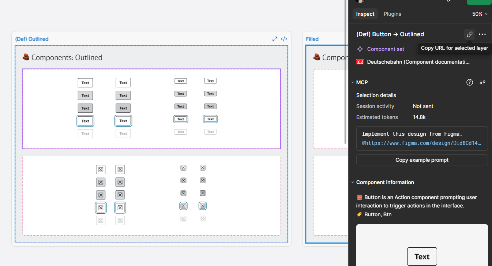
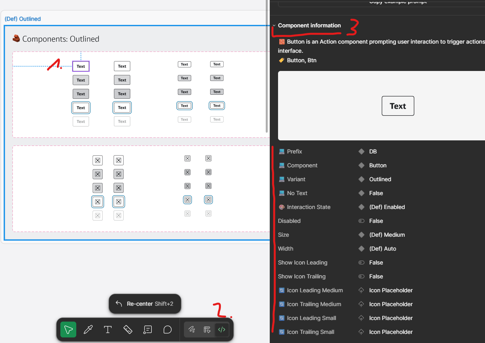
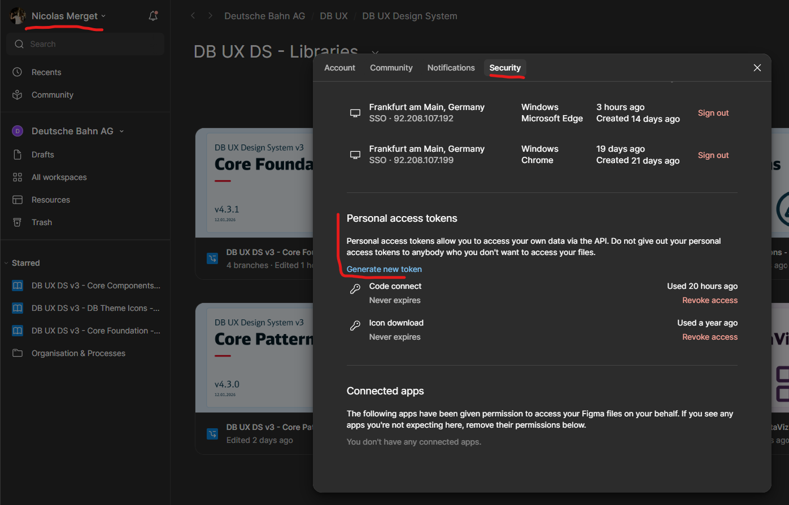

# How to Connect Figma Components

This guide explains how to connect Figma components to code components using Figma Connect.

## Structure

Each component with Figma integration has a `figma/` folder containing:

- `[component].figma.ts` - Configuration mapping Figma properties to code props
- `[variant].figma.lite.tsx` - Mitosis component files for each variant

## Setup

### 1. Get Figma Component URL

<!-- TODO: Add screenshot showing where to find the component URL in Figma -->

> **NOTE:** Make sure to select the `Component set` and then press the link button.

This will give you a url with a `node_id`, we just need this `node_id` for the next step.

### 2. Create Configuration File

Create `[component].figma.ts`:

```typescript
import { FigmaCodeConnect, FigmaProp } from "../../../shared/figma";

const props: Record<string, FigmaProp> = {
	propName: {
		type: "enum", // or 'string', 'boolean'
		key: "Figma Property Name",
		value: {
			"Figma Value": "code-value"
		}
	}
};

export const componentConnect: FigmaCodeConnect = {
	urls: ["https://www.figma.com/design/FIGMA_FILE?node-id=..."],
	props
};
```

### 2.1 Add `FIGMA_FILE` inside `.env`

When coping a link to a component you get the path for the figma file including the branch.

You need to add this as `FIGMA_FILE=xxx/testing-branch` to `.env` see [.env.template](/.env.template) as reference.

### 3. Map Figma Properties

Map Figma properties to code props:

- `type`: Property type (`enum`, `string`, `boolean`, `instance`)
- `key`: Exact Figma property name
- `value`: Mapping object (for enums) or nested config (for instances)



1. Click on a specific component
2. Select dev mode
3. Look at the required properties and convert them

> **NOTE:** Make sure that every Component set may have different properties.
> If a property doesn't exist in a component set Figma will reject the connection.

### 4. Create Mitosis Component

Create `[variant].figma.lite.tsx`:

```typescript
import { useMetadata } from '@builder.io/mitosis';
import { DBComponent } from '../index';
import { componentConnect } from './component.figma';

useMetadata({ figma: componentConnect });

export default function ComponentFigmaLite(props) {
  return <DBComponent propName={props.propName} />;
}
```

## Property Types

- **enum**: Maps Figma dropdown values to code values
- **string**: Direct text mapping
- **boolean**: True/false properties
- **instance**: Nested component instances (e.g., icons)

## Example

See `packages/components/src/components/button/figma/` for a complete implementation.

## Testing

Run this to generate all figma files via Mitosis:

`npm run generate:figma --workspace=@db-ux/core-components`

Next you can look at e.g. `figma-code-connect/react-figma`.
The generates files should be inside `src` folder.

Test them with: `npm run test --workspace=react-figma`

## Publish in test-branch

If you want to publish you need an `FIGMA_ACCESS_TOKEN`.

Go to your Figma account and generate a token.



Next you need to create a new environment file like `figma-code-connect/react-figma/.env`.

Add the token to the file `FIGMA_ACCESS_TOKEN="figd-XXX"`.

Publish with: `npm run publish --workspace=react-figma`
