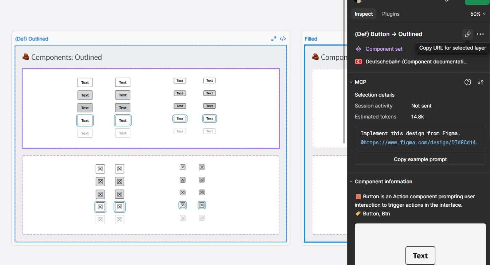
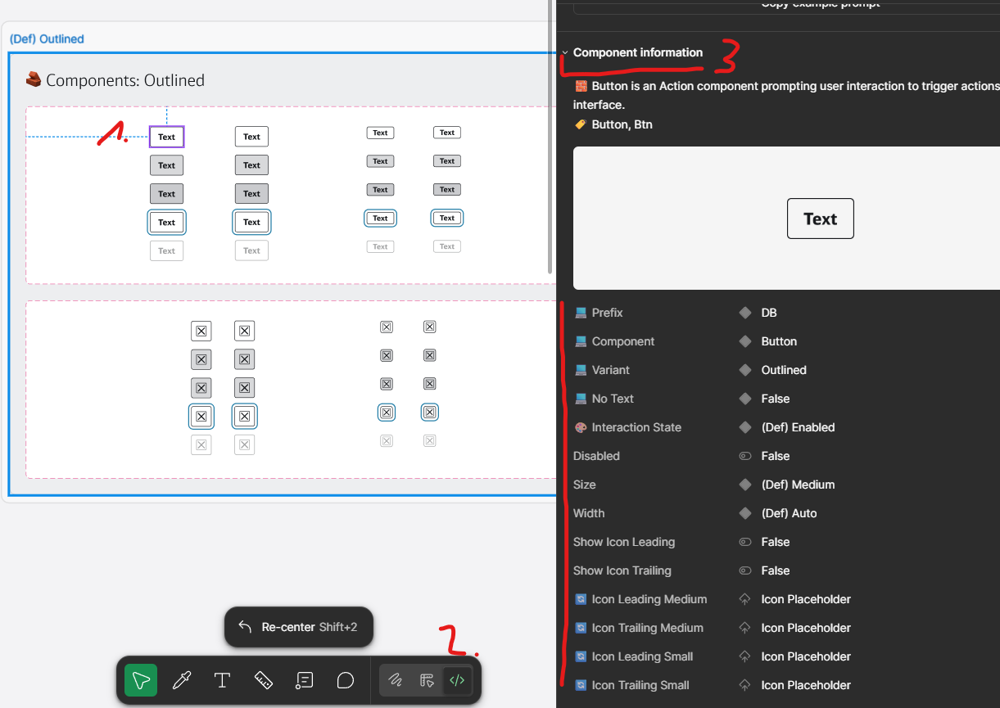
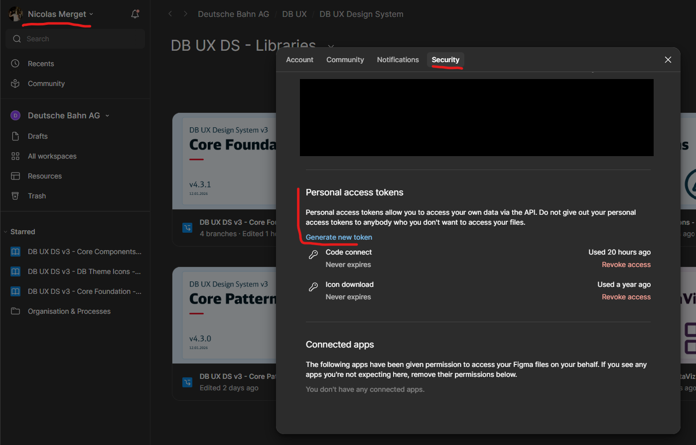

# How to Connect Figma Components

This guide explains how to connect Figma components to code components using [Figma Code Connect](https://www.figma.com/developers/api#code-connect) and [Mitosis](https://github.com/BuilderIO/mitosis).

## Prerequisites

- Access to the Figma design file
- A `FIGMA_FILE` value in your `.env` (see [Step 3](#3-add-figma_file-to-env))
- A `FIGMA_ACCESS_TOKEN` for publishing (see [Publishing](#publishing))

## Structure

Each component with Figma integration has a `figma/` folder:

```text
src/components/button/figma/
├── button.figma.ts                  # Configuration mapping Figma properties to code props
└── button.figma.lite.tsx            # Mitosis component (single file — all variants share the same JSX)
```

Some components have multiple Figma component sets with structurally different JSX and require separate lite files per variant:

```text
src/components/badge/figma/
├── badge.figma.ts
├── badge.figma.lite.tsx             # Standard badge variant
└── dot.badge.figma.lite.tsx         # Dot badge variant (different JSX structure)
```

Use a **single lite file** when all Figma component sets produce the same JSX (variants only differ in prop values like `size` or `variant`). Use **multiple lite files** when the JSX structure itself differs between sets (e.g. different children or slots).

## How the Plugin Works

The Figma plugin uses two Mitosis hooks:

**`json.pre`** — runs before code generation:

1. Validates `FIGMA_FILE` env var
2. Removes all attribute bindings from the JSON nodes (so Mitosis doesn't emit them)
3. Replaces slot child nodes (`_text` bindings) with variable references
4. Pre-computes all declarations and stores them on `figmaMeta._precomputed`

**`code.post`** — runs after code generation:

1. Extracts the generated template from the Mitosis output
2. Replaces framework-specific slot rendering (`{prop}`, `{{prop}}`) with `${prop}`
3. Injects all conditional attribute variables after the opening tag
4. Returns the final `figma.code` template string

All attribute props are injected conditionally using `instance.getPropertyValue(key) !== undefined` — so props that don't exist on a particular Figma variant are automatically omitted from the output.

## Step-by-Step Guide

### 1. Get the Figma Component URL



1. Select the **Component set** in Figma (not an individual variant)
2. Click the **link button** to copy the URL

The URL looks like: `https://www.figma.com/design/XXXXX/file-name?node-id=14436-13065`

You only need the `node-id` value for the configuration file.

> **Note:** Each component set has its own `node-id`. If a component has multiple sets (e.g., "with text" and "without text" buttons), you need a separate `node-id` for each.

### 2. Identify Figma Properties



1. Select a specific component instance in Figma
2. Switch to **Dev Mode**
3. Review the properties panel on the right side

Note the exact property names (e.g., `Size`, `💻 Variant`, `✏️ Text`) — these must match exactly in your configuration.

> **Important:** Different component sets within the same component may have different properties. If you reference a property that doesn't exist in a component set, it will simply be omitted from the output — no error.

### 3. Add `FIGMA_FILE` to `.env`

When you copy a component link, the URL contains the Figma file path including the branch:

```text
https://www.figma.com/design/ABC123/my-branch?node-id=...
                              ^^^^^^^^^^^^^^^
```

Add the value between `design/` and `?node-id` to your `.env` file:

```env
FIGMA_FILE=ABC123/my-branch
```

See [.env.template](/.env.template) for reference.

> **⚠️ Security:** Never commit `.env` files or personal access tokens.

### 4. Create the Configuration File

Create `figma/[component].figma.ts` to map Figma properties to code props.

**Example** from `button.figma.ts`:

```typescript
import { FigmaCodeConnect, FigmaProp } from "../../../shared/figma";

const defaultButtonProps: Record<string, FigmaProp> = {
	disabled: {
		type: "enum",
		key: "Disabled",
		value: { False: false, True: true }
	},
	size: {
		type: "enum",
		key: "Size",
		value: { Small: "small", "(Def) Medium": "medium" }
	},
	text: { type: "textContent", key: "✏️ Text" },
	variant: {
		type: "enum",
		key: "💻 Variant",
		value: {
			Brand: "brand",
			Ghost: "ghost",
			Filled: "filled",
			Outlined: "outlined"
		}
	}
};

export const textButtons: FigmaCodeConnect = {
	urls: [
		"https://www.figma.com/design/FIGMA_FILE?node-id=14436-13065",
		"https://www.figma.com/design/FIGMA_FILE?node-id=14436-13355"
	],
	props: defaultButtonProps
};
```

> **Note:** `FIGMA_FILE` in the URLs is a placeholder that gets replaced at build time with the value from your `.env` file.

#### Props constants: one variable per `props` field

> **⚠️ Mitosis constraint:** Mitosis parses the `props` value in `useMetadata` as JSON5. This means `props` must point to **a single named variable** — not an inline object literal with multiple variable references.

```typescript
// ❌ Fails — Mitosis cannot resolve the inline object
export const myComponent: FigmaCodeConnect = {
	urls: [...],
	props: { semantic: semanticProp, disabled: disabledProp }
};

// ✅ Correct — a single named variable
const myComponentProps: Record<string, FigmaProp> = {
	semantic: { type: 'enum', key: 'Semantic', value: { ... } },
	disabled: { type: 'enum', key: 'Disabled', value: { False: false, True: true } }
};

export const myComponent: FigmaCodeConnect = {
	urls: [...],
	props: myComponentProps
};
```

Spreads inside the `Record` variable itself are fine — Mitosis only has trouble with the inline object passed directly to `props`:

```typescript
// ✅ Spreads inside the variable are fine
const extendedProps: Record<string, FigmaProp> = {
	...baseProps,
	icon: { type: 'iconSwap', ... }
};
```

Also note that Mitosis **cannot resolve template literals** in URLs:

```typescript
// ❌ Fails
const FILE = "mlJ6R0GkfR15a93KSlqXtB";
urls: [`https://www.figma.com/design/${FILE}?node-id=14442:18427`];

// ✅ Correct — plain string
urls: ["https://www.figma.com/design/FIGMA_FILE?node-id=14442:18427"];
```

### 5. Create the Mitosis Component

Create `figma/[variant].[component].figma.lite.tsx` for each variant. If all variants share the same JSX, a single `[component].figma.lite.tsx` is enough.

#### What belongs in the lite file

The plugin automatically injects all attribute props from the figma config. The lite file should only contain:

- **Hardcoded static props** — values that never change (e.g. `type="button"`, `name="checkbox"`, `size="medium"`)
- **Slot/children content** — `{props.text}`, `{props._children}`, `{props.label}`
- **Complex non-figma expressions** — e.g. `options={[...]}`, `trigger={<DBButton>}`

```tsx
// ✅ Correct — only static props and slot content
export default function TextButtonFigmaLite(props: FigmaButtonProps) {
	return <DBButton type="button">{props.text}</DBButton>;
}

// ❌ Wrong — do not pass figma props as attributes
export default function TextButtonFigmaLite(props: FigmaButtonProps) {
	return (
		<DBButton
			type="button"
			disabled={props.disabled} // ❌ remove this
			size={props.size} // ❌ remove this
			variant={props.variant} // ❌ remove this
		>
			{props.text}
		</DBButton>
	);
}
```

The plugin's `json.pre` hook removes all attribute bindings before Mitosis generates code, then `code.post` injects them conditionally using `getPropertyValue` guards.

#### The `_children` prop name

Mitosis reserves `props.children` as a special slot. For slot/children props in figma configs, always use `_children` as the prop name:

```typescript
// ✅ Correct
_children: { type: 'nestedConnectedInstances', filter: 'DBAccordionItem' }

// ❌ Wrong — conflicts with Mitosis reserved prop
children: { type: 'nestedConnectedInstances', filter: 'DBAccordionItem' }
```

In the lite file:

```tsx
export default function AccordionFigmaLite(props: FigmaAccordionProps) {
	return <DBAccordion>{props._children}</DBAccordion>;
}
```

## Property Types

| Type                       | Description                                                                                                                                     |
| -------------------------- | ----------------------------------------------------------------------------------------------------------------------------------------------- |
| `string`                   | Direct text input — `instance.getString(key)`                                                                                                   |
| `boolean`                  | Figma `False/True` toggle — `instance.getEnum(key, { 'False': false, 'True': true })` — shorthand for the common boolean enum pattern           |
| `enum`                     | Maps Figma dropdown/toggle values to code values — `instance.getEnum(key, { ... })`                                                             |
| `children`                 | Named slot content — `instance.getSlot(key)`                                                                                                    |
| `textContent`              | Text rendered as children or screenreader label — `instance.getString(key)`                                                                     |
| `instance`                 | Nested component instance swap — `instance.getInstanceSwap(key)?.executeTemplate()?.example`                                                    |
| `iconSwap`                 | Icon instance swap rendered as plain string attribute — extracts `CODE` section `.code` from `getInstanceSwap(key)?.executeTemplate()?.example` |
| `nestedText`               | Text from a named nested instance — `instance.findInstance(layerName)?.getString(key)`                                                          |
| `connectedText`            | Text from the first code-connected child with that property key                                                                                 |
| `validationMessage`        | Message text mapped to `message`/`invalidMessage`/`validMessage` based on a condition prop                                                      |
| `conditionalProp`          | Single icon swap rendered as a named attribute only when a boolean Figma property (`guardKey`) is `'True'`                                      |
| `connectedInstances`       | All direct code-connected child instances rendered as children                                                                                  |
| `nestedConnectedInstances` | Code-connected children filtered by component name, traversing helper layers                                                                    |

### `boolean` — Figma False/True toggles

Most Figma boolean properties use a `False/True` dropdown rather than a native boolean. Use `type: 'boolean'` as a shorthand — the plugin automatically generates `getEnum` with the correct `False/True` mapping:

```typescript
// ✅ Correct — shorthand, plugin generates getEnum('Disabled', { 'False': false, 'True': true })
disabled: { type: 'boolean', key: 'Disabled' }
showIcon: { type: 'boolean', key: 'Show Icon' }

// ❌ Verbose — unnecessary, use the shorthand above
disabled: {
	type: 'enum',
	key: 'Disabled',
	value: { False: false, True: true }
}
```

Only use `type: 'enum'` when the Figma property has values other than `False/True`.

### `textContent` vs `string`

Both generate `instance.getString()` but serve different purposes:

- `string` — for attribute props (e.g. `headlinePlain="..."`)
- `textContent` — for text rendered as children or as a screenreader label (e.g. `<DBBadge>{text}</DBBadge>`)

Use `textContent` in the lite file as `{props.propName}` children. The plugin keeps `textContent` bindings in the JSON and replaces them in the template.

### `iconSwap` — icon instance swaps

Icons in Figma are instance swaps that resolve to icon name strings via the icon batch files. Use `iconSwap` (not `instance`) as the value type inside an `enum` prop:

```typescript
// ✅ Correct — resolves to icon name string rendered as plain attribute
icon: {
	type: "enum",
	key: "Size",
	value: {
		Small: { type: "iconSwap", key: "🔄 Icon Small" },
		"(Def) Medium": { type: "iconSwap", key: "🔄 Icon Medium" }
	}
}
```

The generator guards each swap with `typeof instance.getPropertyValue(swapKey) === 'string'` — so if the swap doesn't exist on a particular variant (e.g. a text-only badge), the prop is safely omitted.

When the icon should only appear if a Figma boolean property is `'True'` (e.g. `Show Icon Leading`), add `guardKey`:

```typescript
// ✅ Size-based icon swap, only emitted when 'Show Icon Leading' === 'True'
iconLeading: {
	type: "enum",
	key: "Size",
	guardKey: "Show Icon Leading",
	value: {
		Small: { type: "iconSwap", key: "🔄 Icon Leading Small" },
		"(Def) Medium": { type: "iconSwap", key: "🔄 Icon Leading Medium" }
	}
}
```

### `nestedText` — text from a named nested instance

Use when the text lives inside a specific named child component (e.g. an infotext inside a checkbox):

```typescript
message: { type: "nestedText", layerName: "Infotext - (Def) Auto Width", key: "✏️ Text" }
```

### `connectedText` — text from a code-connected child

```typescript
message: { type: "connectedText", key: "✏️ Text", index: 0 }
```

Generates:

```js
instance
	.findConnectedInstances((node) => node.hasCodeConnect())
	.filter((node) => node.type === "INSTANCE")
	.filter((node) => !!node.properties["✏️ Text"])[0]
	?.getString("✏️ Text");
```

### `connectedInstances` — dynamic children from Figma

Use when a container component should render its child instances dynamically:

```typescript
_children: {
	type: "connectedInstances";
}
```

In the lite file:

```tsx
export default function AccordionFigmaLite(props: FigmaAccordionProps) {
	return <DBAccordion>{props._children}</DBAccordion>;
}
```

### `nestedConnectedInstances` — children behind helper layers

Some Figma components mix different component types (e.g. accordion items interleaved with dividers). Use `filter` to keep only the relevant component:

```typescript
_children: { type: "nestedConnectedInstances", filter: "DBAccordionItem" }
```

Generates:

```js
instance
	.findConnectedInstances((node) => node.hasCodeConnect(), {
		traverseInstances: true
	})
	.filter((node) => node.type === "INSTANCE")
	.filter((node) =>
		node
			.executeTemplate()
			.example.some(
				(section) =>
					section.type === "CODE" &&
					section.nestedImports?.some((i) =>
						i.includes("DBAccordionItem")
					)
			)
	)
	.reverse()
	.flatMap((child) => child.executeTemplate().example);
```

> **How to find the right `filter` value:** Use the component name as it appears in the import statement (e.g. `DBAccordionItem`, `DBTabItem`).

### `validationMessage` — conditional message attribute

Use when a message prop maps to different attribute names depending on validation state:

```typescript
message: {
	type: "validationMessage",
	key: "✏️ Text",
	conditionProp: "validation",
	map: {
		invalid: "invalidMessage",
		valid: "validMessage",
		default: "message"
	}
}
```

Generates:

```js
const _messageMessage = instance
	.findConnectedInstances((node) => node.hasCodeConnect())
	.filter((node) => node.type === "INSTANCE")
	.filter((node) => !!node.properties["✏️ Text"])[0]
	?.getString("✏️ Text");
let message = "";
if (_messageMessage) {
	let messageAttr = "message";
	if (validation === "invalid") messageAttr = "invalidMessage";
	if (validation === "valid") messageAttr = "validMessage";
	message = `\n\t\t${messageAttr}="${_messageMessage}"`;
}
```

Injected as `<DBCheckbox${message} ...>`. When empty, nothing is rendered.

> **Do not add the prop to the lite file** — the plugin injects it automatically.

### `conditionalProp` — single icon swap with guard and attribute name remap

Use when a single icon swap should only appear when a Figma boolean property is `'True'`, **and** the attribute name differs from the prop name (e.g. `iconLeading` prop → `icon` attribute):

```typescript
iconLeading: {
	type: "conditionalProp",
	key: "🔄 Icon Leading",
	guardKey: "Show Icon Leading",
	attrName: "icon"
}
```

Generates:

```js
const _iconLeadingValue = ((r) =>
	r && r[0]?.type === "CODE" ? r[0].code : undefined)(
	instance.getInstanceSwap(_findKey("Show Icon Leading"))?.executeTemplate()
		?.example
);
let iconLeading = "";
if (
	(instance.getPropertyValue(_findKey("Show Icon Leading")) === true ||
		instance.getPropertyValue(_findKey("Show Icon Leading")) === "True") &&
	_iconLeadingValue !== undefined &&
	_iconLeadingValue !== null
) {
	iconLeading = `\n\t\ticon="${_iconLeadingValue}"`;
}
```

If the attribute name matches the prop name and you need size-based swap selection, use `enum` + `guardKey` instead (see [`iconSwap`](#iconswap--icon-instance-swaps)).

> **Do not add the prop to the lite file** — the plugin injects it automatically.

## Single vs Multiple Lite Files

If multiple Figma component sets produce identical JSX (only differing in a prop value like `size`), merge them into a single lite file:

```typescript
const checkboxProps: Record<string, FigmaProp> = {
	size: {
		type: "enum",
		key: "💻 Size",
		value: { "(Def) Medium": "medium", Small: "small" }
	}
	// ...
};

export const checkboxes: FigmaCodeConnect = {
	urls: [
		"https://www.figma.com/design/FIGMA_FILE?node-id=2068:3423", // Medium Auto
		"https://www.figma.com/design/FIGMA_FILE?node-id=10707:19709", // Medium Full
		"https://www.figma.com/design/FIGMA_FILE?node-id=2068:3548", // Small Auto
		"https://www.figma.com/design/FIGMA_FILE?node-id=10707:19958" // Small Full
	],
	props: checkboxProps
};
```

## Testing

1. Generate all Figma files via Mitosis:

    ```shell
    pnpm run generate:figma --workspace=@db-ux/core-components
    ```

2. Check the generated output in `figma-code-connect/react-figma/src/`.

3. Run the tests:

    ```shell
    pnpm run test --workspace=react-figma
    ```

### Update snapshots

After any change to `.figma.ts` or `.figma.lite.tsx` files, update the snapshots for all three frameworks:

```shell
pnpm run test:update --workspace=react-figma
pnpm run test:update --workspace=angular-figma
pnpm run test:update --workspace=vue-figma
```

> **When required:** Whenever you add a new component, change URLs, change props, or change example templates. The CI will fail if snapshots are out of date.

The snapshot files live at:

```text
figma-code-connect/react-figma/test/__snapshots__/parse.spec.ts.snap
figma-code-connect/angular-figma/test/__snapshots__/parse.spec.ts.snap
figma-code-connect/vue-figma/test/__snapshots__/parse.spec.ts.snap
```

These files **must be committed** — they are the baseline for CI.

## Publishing

### Generate a Figma Access Token

1. Go to your [Figma account settings](https://www.figma.com/settings)
2. Generate a personal access token



### Publish to Figma

1. Create `figma-code-connect/react-figma/.env` with your token:

    ```env
    FIGMA_ACCESS_TOKEN="figd_XXX"
    ```

    > **⚠️ Security:** Keep this token local and do not commit it.

2. Publish:

    ```shell
    pnpm run connect --workspace=react-figma
    ```
